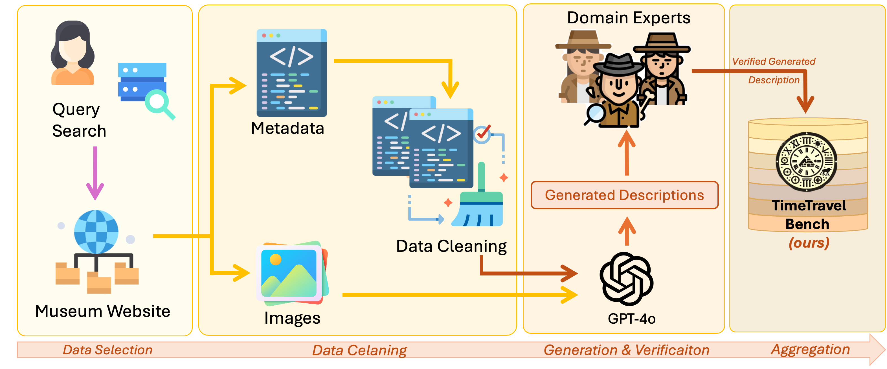

 
 <div style="margin-top:50px;">
      <h1 style="font-size: 30px; margin: 0;"> TimeTravel: A Comprehensive Benchmark to Evaluate LMMs on Historical and Cultural Artifacts</h1>
 </div>
   
 <div  align="center" style="margin-top:10px;"> 
    
  [Sara Ghaboura](https://huggingface.co/SLMLAH) <sup> * </sup> &nbsp;
  [Ketan More](https://huggingface.co/SLMLAH) <sup> * </sup> &nbsp;
  [Retish Thawkar](https://huggingface.co/SLMLAH) <sup> * </sup> &nbsp;
  [Wafa Alghallabi](https://huggingface.co/SLMLAH) <sup> * </sup> &nbsp;
  [Omkar Thawakar](https://omkarthawakar.github.io) <sup> * </sup> &nbsp;
  <br>
  [Fahad Shahbaz Khan](https://scholar.google.com/citations?hl=en&user=zvaeYnUAAAAJ) &nbsp;
  [Hisham Cholakkal](https://scholar.google.com/citations?hl=en&user=bZ3YBRcAAAAJ) &nbsp;
  [Salman Khan](https://scholar.google.com/citations?hl=en&user=M59O9lkAAAAJ) &nbsp;
  [Rao M. Anwer](https://scholar.google.com/citations?hl=en&user=_KlvMVoAAAAJ)
  <br>
  <br>
  [](https://arxiv.org/abs/2502.00094)
  [](https://mbzuai-oryx.github.io/TimeTravel/)
  [](https://github.com/mbzuai-oryx/TimeTravel/issues)
  [](https://github.com/mbzuai-oryx/TimeTravel/stargazers)
  [](https://github.com/mbzuai-oryx/TimeTravel/blob/main/LICENSE)
  <br>
  <em> <sup> *Equal Contribution  </sup> </em>
  <br>
  <br>
</div>


<p align="center">
    
</p> 

 
<div align="center">
 <b> If you like our project, please give us a star ⭐ on GitHub for the latest update. </b><br>
</div>
<br>
<p align="center">
    
</p> 
<br>
<br>

##  Latest Updates

 🤗 **[18 Feb 2025]** TimeTravel dataset available on HuggingFace.<br>
 🔥 **[19 Feb 2025]** TimeTravel the **1<sup>st</sup>** comprehensive open-source benchmark on Historical and Cultural Artifacts is released.<br>
<br>
<br>


##  Overview
<p style="text-align: justify">
TimeTravel is the <b>first comprehensive</b> benchmark for AI-driven historical artifact analysis, designed to identify artifacts within their <b>historical era and cultural context</b>. Spanning <b>266 cultural groups across 10 regions</b>, it prioritizes <b>historical knowledge, contextual reasoning, and cultural preservation</b>, unlike generic object recognition benchmarks. With <b>over 10,000 expert-verified samples</b>, TimeTravel sets a new standard for evaluating multimodal models in historical research, cross-civilizational analysis, and AI-powered cultural heritage preservation.
<br>
<br>
<div style="display: flex; justify-content: space-between; align="center;">
    <figure style="width: 40%;">
      &emsp;&emsp;
      &emsp;&emsp;&emsp;&emsp;&emsp;&emsp;&emsp;
     
    </figure>
</div>
<br>
<h6><em>  <b>Figure 1.</b> Left: TimeTravel Taxonomy maps artifacts from 10 civilizations, 266 cultures, and 10k+ verified samples for AI-driven historical analysis. Right: Regional dataset distribution by archaeological provenance, with Greece holding the largest share (18%) and balanced regional coverage.
</em> 
</h6>
<br>
<br>
</p> 

 ## 🌟 Key Features
### **Key Features of TimeTravel**  
- **First Historical Artifact Benchmark**: The 1<sup>st</sup> large-scale multimodal benchmark for AI-driven historical artifact analysis
- **Broad Coverage**: It spans across **10 civilizations** and **266 cultural groups**.  
- **Expert-Verified Samples**: Over **10k** samples include manuscripts, inscriptions, sculptures, and archaeological artifacts, **manually curated** by historians and archaeologists.  
- **Structured Taxonomy**: Provides a hierarchical framework for artifact classification, interpretation, and cross-civilizational analysis.  
- **AI Evaluation Framework**: Assesses **GPT-4V, LLaVA**, and other LMMs on historical knowledge, contextual reasoning, and multimodal understanding.  
- **Bridging AI and Cultural Heritage**: Enables AI-driven **historical research, archaeological analysis, and cultural preservation**.  
- **Open-Source & Standardized**: A publicly available dataset and evaluation framework to advance AI applications in **history and archaeology**.


<br>


##   TimeTravel Creation Pipeline
The TimeTravel dataset follows a structured pipeline to ensure the accuracy, completeness, and contextual richness of historical artifacts.<br>

Our approach consists of four key phases:
- **Data Selection:** Curated 10,250 artifacts from museum collections, spanning 266 cultural groups, with expert validation to ensure historical accuracy and diversity.<br>
- **Data Cleaning:** Addressed missing or incomplete metadata (titles, dates, iconography) by cross-referencing museum archives and academic sources, ensuring data consistency.<br>
- **Generation & Verification:** Used GPT-4o to generate context-aware descriptions, which were refined and validated by historians and archaeologists for authenticity.<br>
- **Data Aggregation:** Standardized and structured dataset into image-text pairs, making it a valuable resource for AI-driven historical analysis and cultural heritage research.<br>

<p align="center">
   
    <h6>
       <em>  <b>Figure 2.</b> TimeTravel Data Pipeline: A structured workflow for collecting, processing, and refining museum artifact data, integrating GPT-4o-generated descriptions with expert validation for benchmark accuracy.compliance. </em>
    </h6>


 
##  🎯 Quantitative Evaluation and Results


## 🧐 Qualitative Evaluation


<div style="display: flex; justify-content: center; align-items: center; gap: 10px; margin-top: 20px;">
  <p align="center" >
  
  
     <h6>
       <em>  <b>Figure 3.</b> Left: Comparison of AIN-7B’s qualitative performance against other models across multiple domains. Right: Qualitative examples showcasing AIN-7B’s capabilities across various domains, including general VQA, OCR & Document Understanding, Remote Sensing, Medical Imaging, Agricultural Understanding, and Cultural-Specific tasks. </em>
    </h6>
  </p> 
</div>
<br>


---
## ⚖️ License
This project is licensed under the MIT License - see the [LICENSE](LICENSE) file for details.
<br>
<br>

## 💬 Contact us
For questions or suggestions, feel free to reach out to us on [GitHub Discussions](https://github.com/mbzuai-oryx/TimeTravel/discussions).

---

## 📚 Citation

If you use TimeTravle dataset in your research, please consider citing:

```bibtex

```
<br>

---


<p align="center">
   
   
   
</p>
