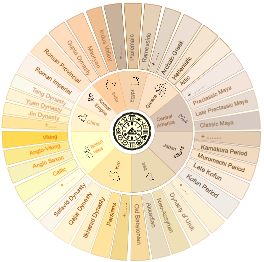
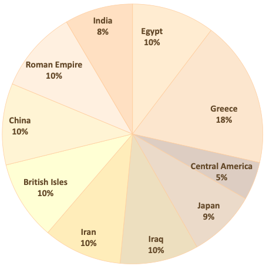
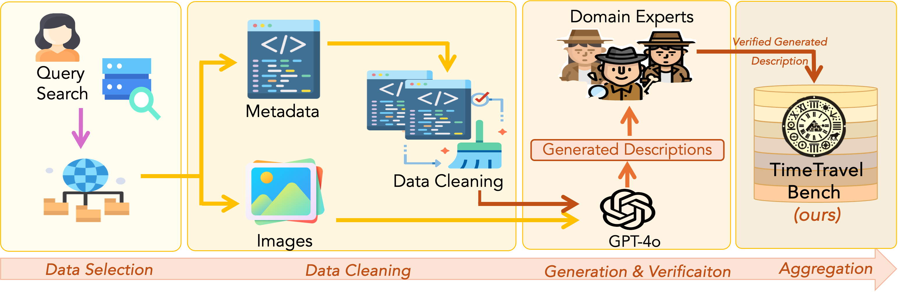
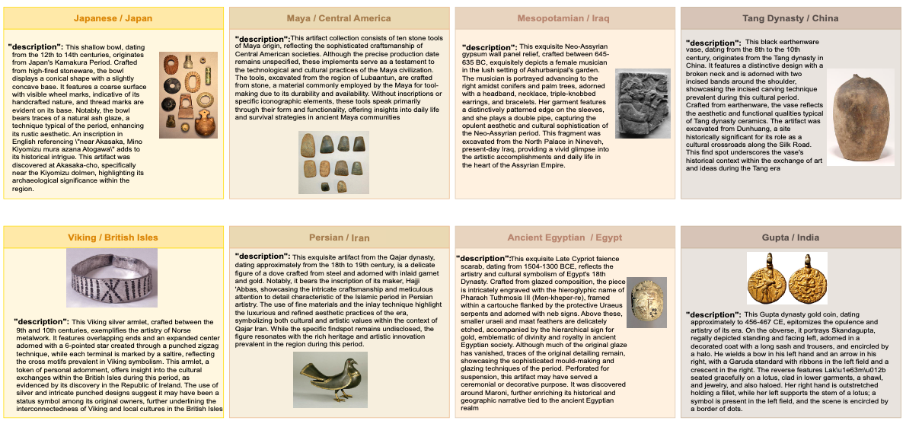
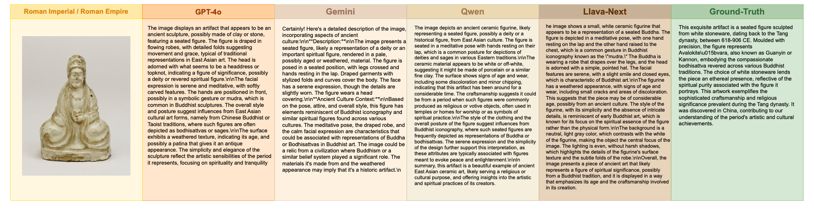

 
 <div style="margin-top:50px;">
      <h1 style="font-size: 30px; margin: 0;"> TimeTravel: A Comprehensive Benchmark to Evaluate LMMs on Historical and Cultural Artifacts</h1>
 </div>
   
   
 <div  align="center" style="margin-top:10px;"> 
    
  [Sara Ghaboura](https://huggingface.co/SLMLAH) <sup> * </sup> &nbsp;
  [Ketan More](https://github.com/ketanmore2002) <sup> * </sup> &nbsp;
  [Retish Thawkar](https://huggingface.co/SLMLAH) &nbsp;
  [Wafa Alghallabi](https://huggingface.co/SLMLAH) &nbsp;
  [Omkar Thawakar](https://omkarthawakar.github.io)  &nbsp;
  <br>
  [Fahad Shahbaz Khan](https://scholar.google.com/citations?hl=en&user=zvaeYnUAAAAJ) &nbsp;
  [Hisham Cholakkal](https://scholar.google.com/citations?hl=en&user=bZ3YBRcAAAAJ) &nbsp;
  [Salman Khan](https://scholar.google.com/citations?hl=en&user=M59O9lkAAAAJ) &nbsp;
  [Rao M. Anwer](https://scholar.google.com/citations?hl=en&user=_KlvMVoAAAAJ)
  <br>
  <br>  
  [](https://arxiv.org/abs/2502.14865)
  [](https://mbzuai-oryx.github.io/TimeTravel/)
  [](https://github.com/mbzuai-oryx/TimeTravel/issues)
  [](https://github.com/mbzuai-oryx/TimeTravel/stargazers)
  [](https://github.com/mbzuai-oryx/TimeTravel/blob/main/LICENSE)
  <br>
  <em> <sup> *Equal Contribution  </sup> </em>
  <br>
  <br>
</div>


<p align="center">
    
</p> 

 
<div align="center">
 <b> If you like our project, please give us a star ⭐ on GitHub for the latest update. </b><br>
</div>
<br>
<p align="center">
    
</p> 
<br>
<br>

##  Latest Updates

 🤗 **[19 Feb 2025]** TimeTravel dataset available on HuggingFace.<br>
 🔥 **[20 Feb 2025]** TimeTravel the **1<sup>st</sup>** comprehensive open-source benchmark on Historical and Cultural Artifacts is released.<br>
<br>
<br>


##  Overview
<p style="text-align: justify">
TimeTravel is the <b>first comprehensive</b> benchmark for AI-driven historical artifact analysis, designed to identify artifacts within their <b>historical era and cultural context</b>. Spanning <b>266 cultural groups across 10 regions</b>, it prioritizes <b>historical knowledge, contextual reasoning, and cultural preservation</b>, unlike generic object recognition benchmarks. With <b>over 10,000 expert-verified samples</b>, TimeTravel sets a new standard for evaluating multimodal models in historical research, cross-civilizational analysis, and AI-powered cultural heritage preservation.
<br>
<br>
<div style="display: flex; justify-content: space-between; align="center;">
    <figure style="width: 40%;">
      &emsp;&emsp;
      &emsp;&emsp;&emsp;&emsp;&emsp;&emsp;&emsp;
     
    </figure>
</div>
<br>
<h6><em>  <b>Figure 1.</b> Left: TimeTravel Taxonomy maps artifacts from 10 civilizations, 266 cultures, and 10k+ verified samples for AI-driven historical analysis. Right: Regional dataset distribution by archaeological provenance, with Greece holding the largest share (18%) and balanced regional coverage.
</em> 
</h6>
</p> 
<br>
<br>


 ## 🌟 Key Features
### **Key Features of TimeTravel**  
- **First Historical Artifact Benchmark**: The 1<sup>st</sup> large-scale multimodal benchmark for AI-driven historical artifact analysis
- **Broad Coverage**: It spans across **10 civilizations** and **266 cultural groups**.  
- **Expert-Verified Samples**: Over **10k** samples include manuscripts, inscriptions, sculptures, and archaeological artifacts, **manually curated** by historians and archaeologists.  
- **Structured Taxonomy**: Provides a hierarchical framework for artifact classification, interpretation, and cross-civilizational analysis.  
- **AI Evaluation Framework**: Assesses **GPT-4V, LLaVA**, and other LMMs on historical knowledge, contextual reasoning, and multimodal understanding.  
- **Bridging AI and Cultural Heritage**: Enables AI-driven **historical research, archaeological analysis, and cultural preservation**.  
- **Open-Source & Standardized**: A publicly available dataset and evaluation framework to advance AI applications in **history and archaeology**.


<br>


##   TimeTravel Creation Pipeline
The TimeTravel dataset follows a structured pipeline to ensure the accuracy, completeness, and contextual richness of historical artifacts.<br>

<p align="center">
   
    <h6>
       <em>  <b>Figure 2.</b> TimeTravel Data Pipeline: A structured workflow for collecting, processing, and refining museum artifact data, integrating GPT-4o-generated descriptions with expert validation for benchmark accuracy.compliance. </em>
    </h6>
 
Our approach consists of four key phases:
- **Data Selection:** Curated 10,250 artifacts from museum collections, spanning 266 cultural groups, with expert validation to ensure historical accuracy and diversity.<br>
- **Data Cleaning:** Addressed missing or incomplete metadata (titles, dates, iconography) by cross-referencing museum archives and academic sources, ensuring data consistency.<br>
- **Generation & Verification:** Used GPT-4o to generate context-aware descriptions, which were refined and validated by historians and archaeologists for authenticity.<br>
- **Data Aggregation:** Standardized and structured dataset into image-text pairs, making it a valuable resource for AI-driven historical analysis and cultural heritage research.<br>


<br>
 
##  🎯 Quantitative Evaluation and Results
The following tables present a comprehensive evaluation of various multimodal models on the TimeTravel benchmark. The first table compares model performance across multiple metrics, while the second analyzes their ability to describe archaeological artifacts from different civilizations, highlighting variations in accuracy and descriptive depth.

<div align="center";>
<h5>
<table>
    <thead>
        <tr style="background-color: #a52a2a; color: white;">
            <th>Model</th>
            <th>BLEU</th>
            <th>METEOR</th>
            <th>ROUGE-L</th>
            <th>SPICE</th>
            <th>BERTScore</th>
            <th>LLM-Judge</th>
        </tr>
    </thead>
    <tbody>
        <tr>
            <td>GPT-4o-0806</td>
            <td><b>0.1758🏅</b></td>
            <td>0.2439</td>
            <td><b>0.1230🏅</b></td>
            <td><b>0.1035🏅</b></td>
            <td><b>0.8349🏅</b></td>
            <td><b>0.3013🏅</b></td>
        </tr>
        <tr>
            <td>Gemini-2.0-Flash</td>
            <td>0.1072</td>
            <td>0.2456</td>
            <td>0.0884</td>
            <td>0.0919</td>
            <td>0.8127</td>
            <td>0.2630</td>
        </tr>
        <tr>
            <td>Gemini-1.5-Pro</td>
            <td>0.1067</td>
            <td>0.2406</td>
            <td>0.0848</td>
            <td>0.0901</td>
            <td>0.8172</td>
            <td>0.2276</td>
        </tr>
        <tr>
            <td>GPT-4o-mini-0718</td>
            <td>0.1369</td>
            <td><b>0.2658🏅</b></td>
            <td>0.1027</td>
            <td>0.1001</td>
            <td>0.8283</td>
            <td>0.2492</td>
        </tr>
        <tr>
            <td>Llama-3.2-Vision-Inst</td>
            <td>0.1161</td>
            <td>0.2072</td>
            <td>0.1027</td>
            <td>0.0648</td>
            <td>0.8111</td>
            <td>0.1255</td>
        </tr>
        <tr>
            <td>Qwen-2.5-VL</td>
            <td>0.1155</td>
            <td>0.2648</td>
            <td>0.0887</td>
            <td>0.1002</td>
            <td>0.8198</td>
            <td>0.1792</td>
        </tr>
        <tr>
            <td>Llava-Next</td>
            <td>0.1118</td>
            <td>0.2340</td>
            <td>0.0961</td>
            <td>0.0799</td>
            <td>0.8246</td>
            <td>0.1161</td>
        </tr>
    </tbody>
</table>
</h5>
<p>
 <h6>
       <em>  <strong>Table:</strong> Performance comparison of various closed and open-source models on our proposed TimeTravel benchmark.</em>
 </h6>      
       </p>
<h5>
<table>
    <thead>
        <tr style="background-color: #a52a2a; color: white;">
            <th>Model</th>
            <th>India</th>
            <th>Roman Emp.</th>
            <th>China</th>
            <th>British Isles</th>
            <th>Iran</th>
            <th>Iraq</th>
            <th>Japan</th>
            <th>Cent. America</th>
            <th>Greece</th>
            <th>Egypt</th>
        </tr>
    </thead>
    <tbody>
        <tr>
            <td>GPT-4o-0806</td>
            <td><b>0.2491🏅</b></td>
            <td><b>0.4463🏅</b></td>
            <td><b>0.2491🏅</b></td>
            <td><b>0.1899🏅</b></td>
            <td><b>0.3522🏅</b></td>
            <td><b>0.3545🏅</b></td>
            <td><b>0.2228🏅</b></td>
            <td><b>0.3144🏅</b></td>
            <td><b>0.2757🏅</b></td>
            <td><b>0.3649🏅</b></td>
        </tr>
        <tr>
            <td>Gemini-2.0-Flash</td>
            <td>0.1859</td>
            <td>0.3358</td>
            <td>0.2059</td>
            <td>0.1556</td>
            <td>0.3376</td>
            <td>0.3071</td>
            <td>0.2000</td>
            <td>0.2677</td>
            <td>0.2582</td>
            <td>0.3602</td>
        </tr>
        <tr>
            <td>Gemini-1.5-Pro</td>
            <td>0.1118</td>
            <td>0.2632</td>
            <td>0.2139</td>
            <td>0.1545</td>
            <td>0.3320</td>
            <td>0.2587</td>
            <td>0.1871</td>
            <td>0.2708</td>
            <td>0.2088</td>
            <td>0.2908</td>
        </tr>
        <tr>
            <td>GPT-4o-mini-0718</td>
            <td>0.2311</td>
            <td>0.3612</td>
            <td>0.2207</td>
            <td>0.1866</td>
            <td>0.2991</td>
            <td>0.2632</td>
            <td>0.2087</td>
            <td>0.3195</td>
            <td>0.2101</td>
            <td>0.2501</td>
        </tr>
        <tr>
            <td>Llama-3.2-Vision-Inst</td>
            <td>0.0744</td>
            <td>0.1450</td>
            <td>0.1227</td>
            <td>0.0777</td>
            <td>0.2000</td>
            <td>0.1155</td>
            <td>0.1075</td>
            <td>0.1553</td>
            <td>0.1351</td>
            <td>0.1201</td>
        </tr>
        <tr>
            <td>Qwen-2.5-VL</td>
            <td>0.0888</td>
            <td>0.1578</td>
            <td>0.1192</td>
            <td>0.1713</td>
            <td>0.2515</td>
            <td>0.1576</td>
            <td>0.1771</td>
            <td>0.1442</td>
            <td>0.1442</td>
            <td>0.2660</td>
        </tr>
        <tr>
            <td>Llava-Next</td>
            <td>0.0788</td>
            <td>0.0961</td>
            <td>0.1455</td>
            <td>0.1091</td>
            <td>0.1464</td>
            <td>0.1194</td>
            <td>0.1353</td>
            <td>0.1917</td>
            <td>0.1111</td>
            <td>0.0709</td>
        </tr>
    </tbody>
</table></h5>
<p>
 <h6>
       <em>  <strong>Table:</strong> Analysis of LLM-Judge evaluation of various models in describing archaeological artifacts across civilizations from different geographical locations.</em>
 </h6>  
</p>

</div>


<br>
<br>

## 🧐 TimeTravel Dataset Examples
Figures 3 and 4 showcase the cultural and material diversity of the TimeTravel dataset alongside a cross-model comparison, highlighting variations in artifact representation, historical periods, material compositions, and descriptive accuracy across different AI models.

<div style="display: flex; justify-content: center; align-items: center;>
  <p align="center" >
    
     <h6>
       <em>  <b>Figure 3.</b> Cultural and Material Diversity: TimeTravel spans civilizations from Ancient Egypt to Japan, covering prehistoric to medieval eras with artifacts in ceramics, metals, and stone, showcasing historical craftsmanship and cultural heritage. </em>
    </h6>
    
    <h6>
       <em>  <b>Figure 4.</b> Cross-Model Comparison: Variations in descriptive depth and accuracy across open- and closed-source models, highlighting interpretative differences and alignment with ground truth. </em>
    </h6>
  </p> 
  
</div>
<br>


## Evaluation

Please refer to Evaluation folder to reproduce the results.


## ⚖️ License
This project is licensed under the MIT License - see the [LICENSE](LICENSE) file for details.
<br>
<br>

## 💬 Contact us
For questions or suggestions, feel free to reach out to us on [GitHub Discussions](https://github.com/mbzuai-oryx/TimeTravel/discussions).


## 📚 Citation

If you use TimeTravle dataset in your research, please consider citing:

```bibtex

```
<br>

---


<p align="center">
   
   
   
</p>
